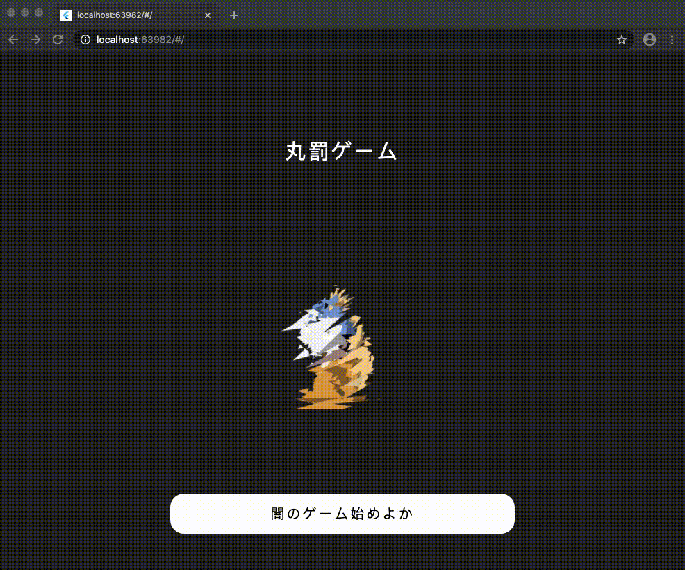

# MaruBatsu

Tic Tak Toe, which is also called `丸罰ゲーム` in Japan.

## Objective

I made this project for the sake of studying `Flutter Web`.

Some components that I learned are as follows:

    - How to move screen (Navigator)
    - How to use Custom Font (google_fonts)
    - How to popup Error Message (oktoast)
    - How to show Dialog (showDialog)
    - How to use Grind (GridView)
    - How to detect tap (GestureDetector)
    - How to get the width/height of screen (MediaQuery)
    - How to use animation (avatar_glow)

## Reference

I was inspired by the following.

- [tictactoeflutter](https://github.com/createdbymitch/tictactoeflutter)